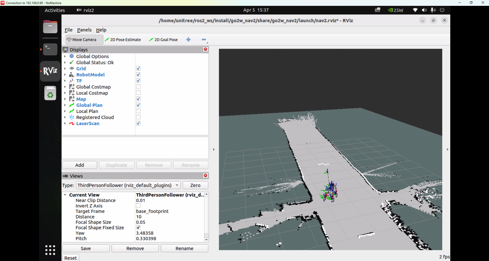
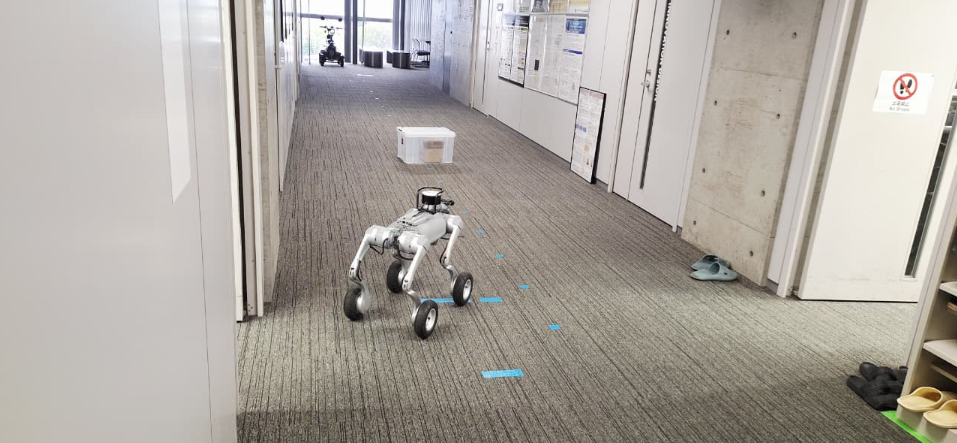

# Unitree-go2w

slide: https://tzf230201.github.io/unitree-go2w-autonomous-carrier/


<p align="center">
	
</p>

## Results

The images below show the SLAM result and the real environment used in the experiment.

<p align="center">
	
</p>

`image_3` shows the map produced by the SLAM pipeline.

<p align="center">
	
</p>

`image_4` shows the real-world location corresponding to the SLAM experiment.

## Packages

| Package | Description |
|---|---|
| `FAST_LIO_ROS2_HesaiLidar_XT16` | FAST-LIO2 with native Hesai PandarXT-16 support (no Livox dependency required) |
| `HesaiLidar_ROS_2.0` | Default Hesai LiDAR ROS 2 driver |
| `go2w_fast_lio2` | Launch & config for FAST-LIO2 + Hesai driver on Go2W |
| `go2w_description` | Go2W URDF/xacro robot description |
| `go2w_joints_state_and_imu_publisher` | Joint states & IMU publisher for Go2W |
| `go2w_cmd_vel_control` | Velocity control for Go2W |
| `pointcloud_to_laserscan` | Convert 3D point cloud to 2D laser scan |

## How to Use this Repo

### 1. Go to workspace
```bash
cd ~/ros2_ws/src/
```

### 2. Clone this repo
```bash
git clone --recurse-submodules https://github.com/tzf230201/unitree-go2w-autonomous-carrier.git
```

### 3. Check out ROS 2 branch for LIO-SAM
```bash
cd LIO-SAM
git checkout ros2
cd ..
```

### 4. Install dependencies
```bash
sudo apt install ros-humble-perception-pcl \
       ros-humble-pcl-msgs \
       ros-humble-vision-opencv \
       ros-humble-xacro \
       ros-humble-pcl-conversions
sudo apt-get install libboost-all-dev libyaml-cpp-dev
```

### 5. Build packages
```bash
cd ~/ros2_ws

# Build hesai_ros_driver first
colcon build --packages-select hesai_ros_driver

# Source, then build fast_lio (native Hesai support, no Livox SDK needed)
source install/setup.bash
colcon build --packages-select fast_lio

# Source, then build remaining packages
source install/setup.bash
colcon build
```

### 6. Run FAST-LIO2 with Hesai PandarXT-16
```bash
source ~/ros2_ws/install/setup.bash
ros2 launch go2w_fast_lio2 fast_lio2.launch.py rviz:=true
```

This launches:
- Hesai LiDAR driver (default, publishes `/lidar_points`)
- FAST-LIO2 with native Hesai handler (`lidar_type: 5`)
- Go2W robot description & joint state publisher
- RViz2 (optional, disable with `rviz:=false`)

### 7. Run `go2w_nav2` SLAM and navigation

The `go2w_nav2` SLAM launch now starts the required navigation stack around FAST-LIO2:
- `go2w_fast_lio2` is launched automatically by default with FAST-LIO RViz disabled
- `/Odometry` is projected into a planar `/odom`
- FAST-LIO point cloud is converted into `/scan`
- `slam_toolbox`, Nav2, RViz, and `go2w_cmd_vel_control` are launched together

Run:

```bash
source ~/ros2_ws/install/setup.bash
ros2 launch go2w_nav2 slam.launch.py
```

If you already launched FAST-LIO2 in another terminal, disable the internal include:

```bash
source ~/ros2_ws/install/setup.bash
ros2 launch go2w_nav2 slam.launch.py launch_fast_lio:=false
```

Useful options:

```bash
# Disable Nav2 RViz
ros2 launch go2w_nav2 slam.launch.py nav2_rviz:=false

# Disable cmd_vel bridge to the robot
ros2 launch go2w_nav2 slam.launch.py launch_cmd_vel_bridge:=false
```

How to use RViz:
- Wait a few seconds until FAST-LIO2, SLAM, and Nav2 are all active.
- Use `2D Pose Estimate` to set the robot initial pose on the map.
- Use `2D Goal Pose` to send a navigation goal.
- When navigation is successful, Nav2 publishes `/cmd_vel`, and `go2w_cmd_vel_control` forwards it to `/api/sport/request`.

Important notes for successful `go2w_nav2` operation:
- `go2w_nav2` depends on valid `/scan`, `/odom`, `/map`, and TF between `map -> odom -> base_footprint`.
- The package includes a planar odometry projector and pointcloud-to-laserscan converter because Nav2 and `slam_toolbox` expect 2D navigation data.
- The Nav2 behavior tree XML files must be set correctly. If they are empty, RViz goals are accepted but immediately fail with `Behavior tree threw exception: Empty Tree`.
- If a goal is received but the robot does not move, check whether `/navigate_to_pose/_action/status` becomes `6` (`ABORTED`).
- If old processes are still running, restart the launch completely after rebuilding:

```bash
source ~/ros2_ws/install/setup.bash
ros2 launch go2w_nav2 slam.launch.py
```

### (Optional) Livox LiDAR support

If you want to use a Livox LiDAR instead, install Livox SDK2 and `livox_ros_driver2`:

```bash
# Install Livox SDK2
cd /tmp
git clone https://github.com/Livox-SDK/Livox-SDK2
cd Livox-SDK2
mkdir build && cd build
cmake .. && make -j$(nproc)
sudo make install

# Build livox_ros_driver2
cd ~/ros2_ws
colcon build --packages-select livox_ros_driver2 \
  --cmake-args -DROS_EDITION=ROS2 -DHUMBLE_ROS=humble

# Rebuild fast_lio (will auto-detect livox_ros_driver2 and enable Livox support)
source install/setup.bash
colcon build --packages-select fast_lio
```

## Legacy Navigation Result

<p align="center">
	
</p>

`image_2` shows the Nav2 result from the older version using LIO-SAM (see Realeases V1) of the program and is kept here as a reference.

## Acknowledgement

- `go2w_joints_state_and_imu_publisher` is modified from:
  https://github.com/felixokolo/go2_slam_2d_3d/tree/main/src/go2_joints_state_publisher

- `go2w_cmd_vel_control` is modified from:
  https://github.com/TechShare-inc/go2_unitree_ros2.git

- `pointcloud_to_laserscan` from:
  https://github.com/felixokolo/pointcloud_to_laserscan/tree/97c195bbc84f410263178a02ee1117b661a45015

- `FAST_LIO_ROS2_HesaiLidar_XT16` is based on [FAST-LIO2](https://github.com/hku-mars/FAST_LIO) with added native Hesai point cloud support and optional Livox dependency
