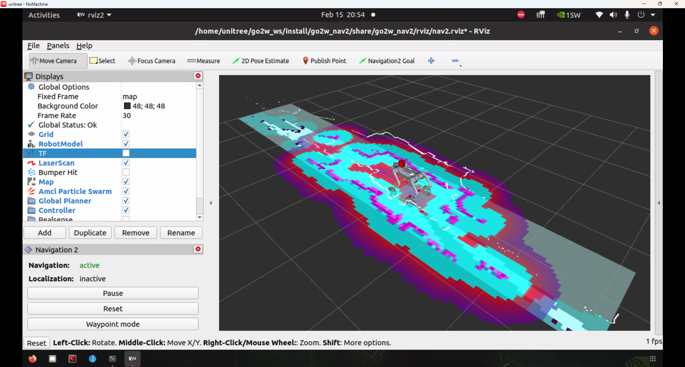

# Unitree-go2w

slide: https://tzf230201.github.io/unitree-go2w-autonomous-carrier/


<p align="center">
	
</p>

# How to Use this Repo
1. go to workspace
```
cd ~/ros2_ws/src/
```

2. clone this repo

```
git clone --recurse-submodules https://github.com/tzf230201/unitree-go2w-autonomous-carrier.git
```
<p align="center">
	
</p>
	


# Acknowledgement:

the go2w_joints_state_and_imu_publisher is modified from this:
https://github.com/felixokolo/go2_slam_2d_3d.git
especiallly this part:
https://github.com/felixokolo/go2_slam_2d_3d/tree/main/src/go2_joints_state_publisher

the go2w_cmd_vel_control is modified from this:
https://github.com/TechShare-inc/go2_unitree_ros2.git

the pointcloud_to_laserscan from : 
https://github.com/felixokolo/pointcloud_to_laserscan/tree/97c195bbc84f410263178a02ee1117b661a45015
