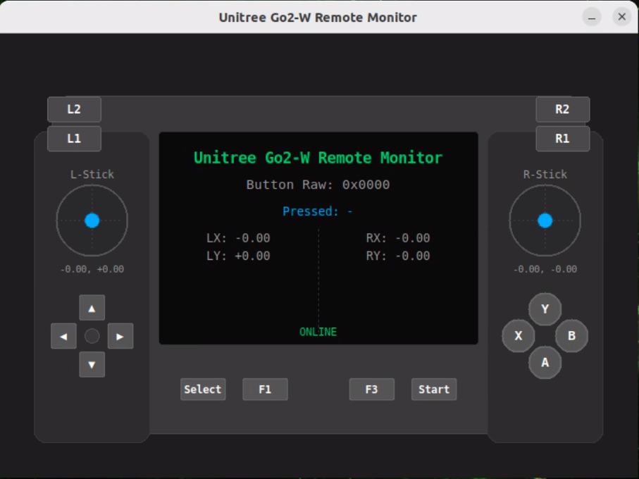
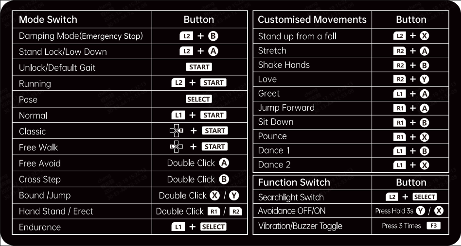

# go2w_remote_monitor

A ROS 2 Python package for reading and visualizing Unitree Go2W remote controller data from the `/lowstate` topic. It provides both terminal logging and a graphical controller-shaped GUI built with Tkinter.



## Controller Button Reference

The image below shows the default button functions on the Unitree Go2 remote controller:



### Mode Switch (Left Side)

| Action | Button |
|---|---|
| Damping Mode / Emergency Stop | L2 + A |
| Lock / Default Gait | L2 + A |
| Unlock / Default Gait | L1 + A |
| Walking | L2 + L1 |
| Running | L2 + L1 (hold) |
| Climbing | L2 + B |
| Prone Stair | L1 + X |
| Cross Stair | Start |
| Stand (Stand 2) | L1 + L2 |
| Round Stand | Double click L2 |
| Endurance | - |

### Customized Movements (Right Side)

| Action | Button |
|---|---|
| Stand up from Prone | L1 + A |
| Stand up from Fall | L1 + A |
| Shake Hands | - |
| Wave | - |
| Press | R2 |
| Sit | R1 |
| Stretch | - |
| Dance | - |

### Function Switch (Bottom Right)

| Action | Button |
|---|---|
| Follow | Double click R1 |
| Bounded Follow | L2 + R2 |
| Vision/Barrier Toggle | - |
| Press 3 / Press 5 | - |

## Where the Remote Data Comes From

The remote controller data is **not** generated by this package. It originates from the Unitree robot's internal driver stack, which publishes a comprehensive status message at high frequency.

### Data Flow

```
Unitree Robot Hardware
    |
    v
unitree_go driver (internal)
    |
    v
ROS 2 Topic: /lowstate
Message Type: unitree_go/msg/LowState
    |
    v
go2w_remote_monitor node (this package)
    |
    v
Decode wireless_remote[40] -> Buttons + Joystick Axes
    |
    v
Terminal Log + Tkinter GUI
```

### The LowState Message

The `unitree_go/msg/LowState` message carries the full robot status. The complete message definition is:

```
uint8[2]        head
uint8           level_flag
uint8           frame_reserve
uint32[2]       sn
uint32[2]       version
uint16          bandwidth
IMUState        imu_state
MotorState[20]  motor_state
BmsState        bms_state
int16[4]        foot_force
int16[4]        foot_force_est
uint32          tick
uint8[40]       wireless_remote    <-- remote controller data lives here
uint8           bit_flag
float32         adc_reel
int8            temperature_ntc1
int8            temperature_ntc2
float32         power_v
float32         power_a
uint16[4]       fan_frequency
uint32          reserve
uint32          crc
```

This package only reads the `wireless_remote` field (40 bytes) and the `tick` field from each incoming message.

### Evidence in This Repository

Other packages in this repository also consume `/lowstate`, confirming it as the standard robot status topic:

- `go2w_lio_sam` subscribes to `/lowstate` to extract IMU data (`imu_state`).
- `go2w_joints_state_and_imu_publisher` subscribes to `/lowstate` to extract motor states and publishes `/joint_states`.
- In `motor_crc.cpp`, the `wireless_remote` field is explicitly copied: `memcpy(&raw.wirelessRemote[0], &msg.wireless_remote[0], 40)`, confirming the 40-byte remote payload is a well-known part of the Unitree protocol.

## How the Data is Parsed

### Button Bitmap (Bytes 2-3)

The button state is encoded as a 16-bit little-endian integer at byte offset 2-3 of the `wireless_remote` array:

```python
key_value = wr[2] | (wr[3] << 8)
```

Each bit in this 16-bit value maps to a specific button. When a bit is `1`, that button is currently pressed:

| Bit | Button | Hex Value | Decimal |
|-----|--------|-----------|---------|
| 0   | R1     | 0x0001    | 1       |
| 1   | L1     | 0x0002    | 2       |
| 2   | Start  | 0x0004    | 4       |
| 3   | Select | 0x0008    | 8       |
| 4   | R2     | 0x0010    | 16      |
| 5   | L2     | 0x0020    | 32      |
| 6   | F1     | 0x0040    | 64      |
| 7   | F3     | 0x0080    | 128     |
| 8   | A      | 0x0100    | 256     |
| 9   | B      | 0x0200    | 512     |
| 10  | X      | 0x0400    | 1024    |
| 11  | Y      | 0x0800    | 2048    |
| 12  | Up     | 0x1000    | 4096    |
| 13  | Right  | 0x2000    | 8192    |
| 14  | Down   | 0x4000    | 16384   |
| 15  | Left   | 0x8000    | 32768   |

Multiple buttons pressed simultaneously are represented by ORing their bit values. For example, pressing **A + R1** at the same time produces `0x0101` (bit 0 + bit 8).

### Joystick Axes (Bytes 4-23)

The joystick axes are encoded as **IEEE 754 float32** values (little-endian), not single bytes. Each axis value ranges from **-1.0 to +1.0**, where 0.0 is the center (neutral) position.

```python
import struct

lx = struct.unpack_from('<f', wr, 4)[0]    # Left stick X   (bytes 4-7)
rx = struct.unpack_from('<f', wr, 8)[0]    # Right stick X  (bytes 8-11)
ry = struct.unpack_from('<f', wr, 12)[0]   # Right stick Y  (bytes 12-15)
# bytes 16-19: L2 trigger axis (unused)
ly = struct.unpack_from('<f', wr, 20)[0]   # Left stick Y   (bytes 20-23)
```

### Complete Byte Layout

```
Offset  Size   Type      Description
------  -----  --------  ---------------------------
0-1     2      uint8     Header (0x55, 0x51)
2-3     2      uint16    Button bitmap (little-endian)
4-7     4      float32   Left stick X  (-1.0 ~ +1.0)
8-11    4      float32   Right stick X (-1.0 ~ +1.0)
12-15   4      float32   Right stick Y (-1.0 ~ +1.0)
16-19   4      float32   L2 trigger axis
20-23   4      float32   Left stick Y  (-1.0 ~ +1.0)
24-37   14     -         Reserved / unused
38-39   2      -         Tail bytes
```

### Idle State Example

When no buttons are pressed and both sticks are centered, the raw bytes look like:

```
[0]=85 [1]=81 [2]=0 [3]=0 [4]=0 [5]=0 [6]=0 [7]=128
[8]=0 [9]=0 [10]=0 [11]=128 [12]=0 [13]=0 [14]=0 [15]=128
[16]=0 [17]=0 [18]=0 [19]=0 [20]=0 ... [38]=1 [39]=128
```

- Header: `85, 81` = `0x55, 0x51`
- Button bitmap: `0, 0` = `0x0000` (no buttons pressed)
- Bytes 7, 11, 15 = `128` = `0x80` which is the sign bit of `-0.0` in IEEE 754 float32 (functionally equivalent to `0.0`)

## Package Structure

```
go2w_remote_monitor/
  go2w_remote_monitor/
    __init__.py
    remote_monitor.py          # Main node + GUI
  images/
    image_1.png                # GUI screenshot
    image_2.png                # Controller button reference
  launch/
    remote_monitor.launch.py
  resource/
    go2w_remote_monitor
  package.xml
  setup.py
  setup.cfg
  README.md
```

## Building

```bash
cd ~/ros2_ws
colcon build --packages-select go2w_remote_monitor --symlink-install
source install/setup.bash
```

## Running

### Via Launch File (Recommended)

```bash
ros2 launch go2w_remote_monitor remote_monitor.launch.py
```

### Via ros2 run

```bash
ros2 run go2w_remote_monitor remote_monitor
```

### Parameters

| Parameter | Default | Description |
|---|---|---|
| `lowstate_topic` | `/lowstate` | The ROS 2 topic to subscribe to for `LowState` messages |

Example with custom topic:

```bash
ros2 run go2w_remote_monitor remote_monitor --ros-args -p lowstate_topic:=/custom_lowstate
```

## GUI

The node launches a Tkinter-based GUI shaped like the actual Go2 remote controller. It displays:

- **Shoulder buttons**: L2/R2 (top), L1/R1 (bottom) — light up green when pressed
- **Left analog stick**: Displays a movable blue dot tracking the stick position in real-time
- **Right analog stick**: Same as the left stick
- **D-Pad**: Up/Down/Left/Right arrows — light up green when pressed
- **Face buttons**: A (green), B (red), X (blue), Y (yellow) — light up in their respective colors when pressed
- **Center buttons**: Select, F1 (left pair), F3, Start (right pair) — light up green when pressed
- **Screen area**: Shows button raw hex value, currently pressed button names, stick axis values (float), and connection status (ONLINE / WAITING)

### Display Auto-Detection

The node automatically detects the X11 display by scanning `/tmp/.X11-unix/`. This allows it to work out-of-the-box with NoMachine remote desktop sessions where the `DISPLAY` environment variable is typically `:1001` rather than the standard `:0`.

## Terminal Output

Regardless of the GUI, the node always logs button changes to the terminal:

```
[INFO] [remote_monitor]: Buttons: A, R1 (raw=0x0101) Sticks: lx=+0.00 ly=+0.85 rx=-0.32 ry=+0.00
[INFO] [remote_monitor]: Released all buttons
```

## Dependencies

- `rclpy`
- `unitree_go` (provides `unitree_go/msg/LowState`)
- `tkinter` (usually included with Python 3 on Ubuntu)
- ROS 2 Humble (or compatible ROS 2 distribution)
